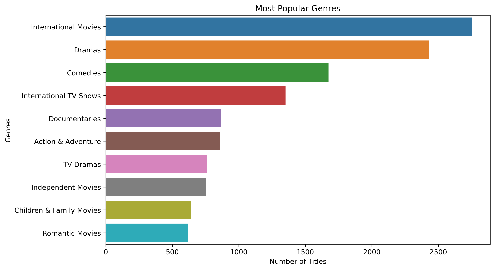
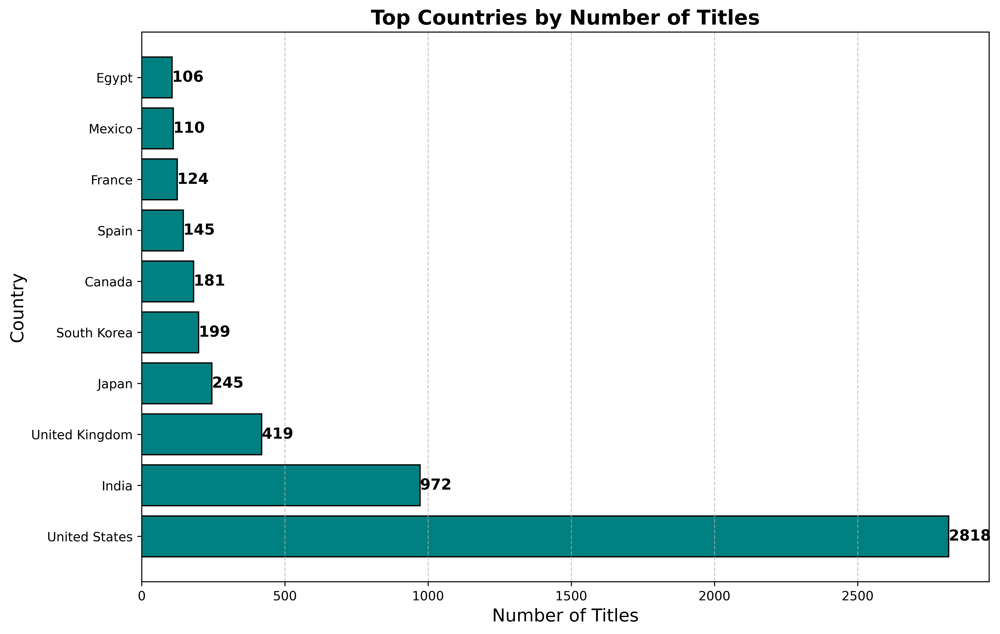
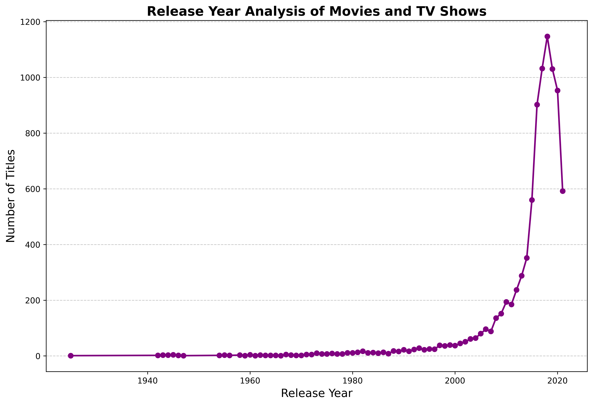

#      Netflix Movies and TV Shows Data Analysis using SQL


# Overview
This project involves a comprehensive analysis of Netflix's movies and TV shows data using SQL. The goal is to extract valuable insights and answer various business questions based on the dataset. This README provides a detailed account of the project's objectives, business problems, solutions, findings, and conclusions.

# Objectives

- Analyze Content Distribution: Examine the distribution of content types (movies vs. TV shows).
- Identify Popular Genres: Determine which genres are most frequently represented in the dataset.
- Examine Rating Trends: Identify the most common ratings for movies and TV shows.
- Explore Country Representation: Analyze content based on countries of origin.
- Track Release Year Trends: Investigate how content releases vary by year.

## Schema
```sql
CREATE TABLE movies_tv_shows (
    show_id TEXT PRIMARY KEY,
    types VARCHAR(255),
    title VARCHAR(255),
    director VARCHAR(255),
    casts TEXT,
    country VARCHAR(255),
    date_added DATE,
    release_year INT,
    rating VARCHAR(255),
    duration VARCHAR(255),
    listed_in TEXT,
    description TEXT
);
```

### Q.1. Most Popular Genres:



```sql
SELECT listed_in, COUNT(*) AS count
FROM movies_tv_shows
GROUP BY listed_in
ORDER BY count DESC;
```

### Q.2. Top Directors:
```sql
SELECT director, COUNT(*) AS count
FROM movies_tv_shows
WHERE director IS NOT NULL
GROUP BY director
ORDER BY count DESC;
```

### Q.3. Trending Content:
```sql
SELECT title, date_added
FROM movies_tv_shows
WHERE date_added IS NOT NULL
ORDER BY date_added DESC;
```
### Q.4. Country Analysis:



```sql
SELECT country, COUNT(*) AS count
FROM movies_tv_shows
WHERE country IS NOT NULL
GROUP BY country
ORDER BY count DESC;
```
### Q.5. Rating Distribution:
```sql
SELECT rating, COUNT(*) AS count
FROM movies_tv_shows
WHERE rating IS NOT NULL
GROUP BY rating;
```
### Q.6. Cast Analysis:
```sql
SELECT casts, COUNT(*) AS count
FROM movies_tv_shows
WHERE casts IS NOT NULL
GROUP BY casts
ORDER BY count DESC;
```
### Q.7. Movies vs. TV Shows:
```sql
SELECT types, COUNT(*) AS count
FROM movies_tv_shows
GROUP BY types;
```
### Q.8. Release Year Analysis:

```sql
SELECT release_year, COUNT(*) AS count
FROM movies_tv_shows
GROUP BY release_year
ORDER BY release_year ASC;
```
### Q.9. Content Added by Year:
```sql
SELECT EXTRACT(YEAR FROM date_added) AS year, COUNT(*) AS count
FROM movies_tv_shows
WHERE date_added IS NOT NULL
GROUP BY year
ORDER BY year ASC;
```
## Q.10. Find Movies with a Specific Keyword in the Title(type it and get the result):
```sql
SELECT title, release_year
FROM movies_tv_shows
WHERE title ILIKE '%keyword%';  -- Replace 'keyword' with the desired term
```

## Findings and Conclusion

- Content Distribution: The dataset reveals a wide array of movies and TV shows, showcasing diverse ratings and genres available on Netflix.

- Common Ratings: Analyzing the most frequent ratings helps in understanding the target demographics and preferences of the audience.

- Geographical Insights: The analysis of content by country, particularly focusing on India, provides valuable information on regional content availability and distribution patterns.

- Content Categorization: By categorizing content based on specific keywords, we gain insights into the thematic elements and nature of the shows and movies offered on Netflix.

This analysis offers a comprehensive perspective on Netflix's content landscape, which can guide strategic decisions regarding content acquisition and marketing.


## Author: Sridhar

I am a passionate data enthusiast currently honing my skills in SQL and data analysis. This project showcases my proficiency in SQL, highlighting my ability to extract meaningful insights from data. I am actively seeking data analysis roles and internships to apply my skills in real-world scenarios. If you have any questions, feedback, or opportunities for collaboration, please feel free to reach out!

- Technologies Used 

SQL for data querying
Python with pandas and matplotlib for analysis and visualization
Self-learning through YouTube for comprehensive data analysis techniques
Guidance from ChatGPT and Gemini AI for coding support
